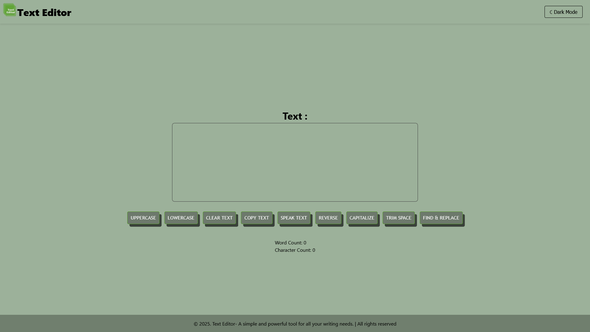
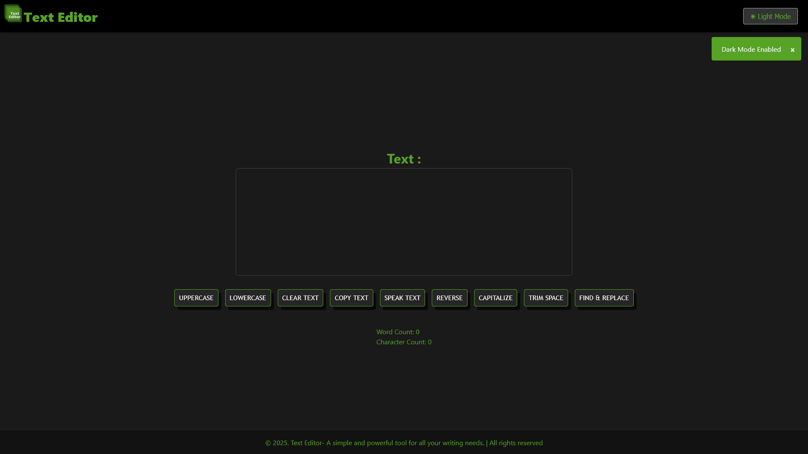
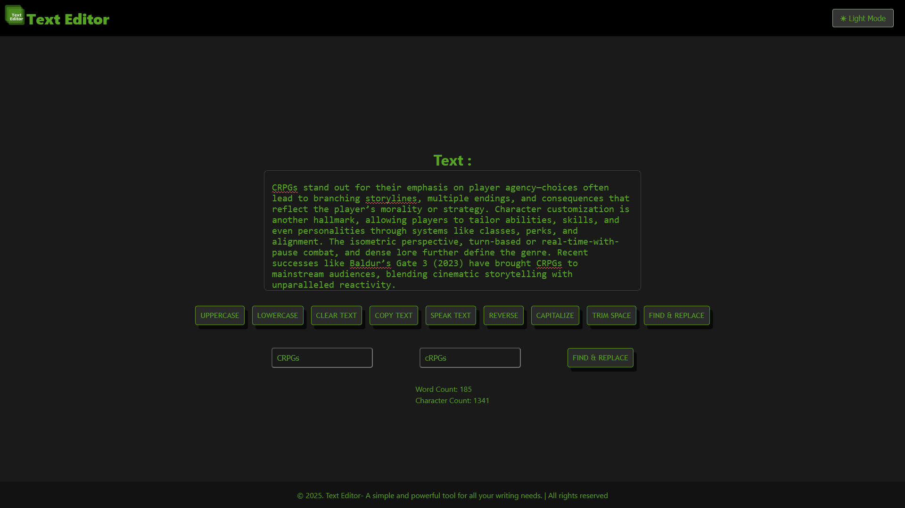

# 📝 Text Editor App

A sleek and functional web-based text editor with light/dark themes, toast notifications, and various text manipulation tools. Built with React, this editor is ideal for writers, developers, and anyone who works with text content regularly.

## 🌟 Features

- ✅ **Dark Mode / Light Mode** toggle
- 🗣️ **Text-to-Speech** support using the Web Speech API
- 🧹 **Text Cleaning Tools**:
  - Convert to **UPPERCASE**
  - Convert to **lowercase**
  - **Clear** entire text
  - **Copy** text to clipboard
  - **Reverse** text
  - **Capitalize** each word
  - **Trim** extra spaces
- 🔍 **Find & Replace** with regular expression support
- 📊 Live statistics:
  - **Word Count**
  - **Character Count**
- 🔔 **Toast Notifications** for actions and feedback

## 🖼️ Screenshots

### ✅ Light Mode


### 🌑 Dark Mode


### 🔄 Find & Replace + Text Example


## 🚀 Tech Stack

- React.js (with hooks)
- Custom Toast Notification System
- CSS Modules or Vanilla CSS
- HTML5 SpeechSynthesis API

## 🌐 Live


## 📦 Getting Started

```bash
git clone https://github.com/arijitkayal-gm/Text-Editor.git
cd Text-Editor
npm install
npm start

