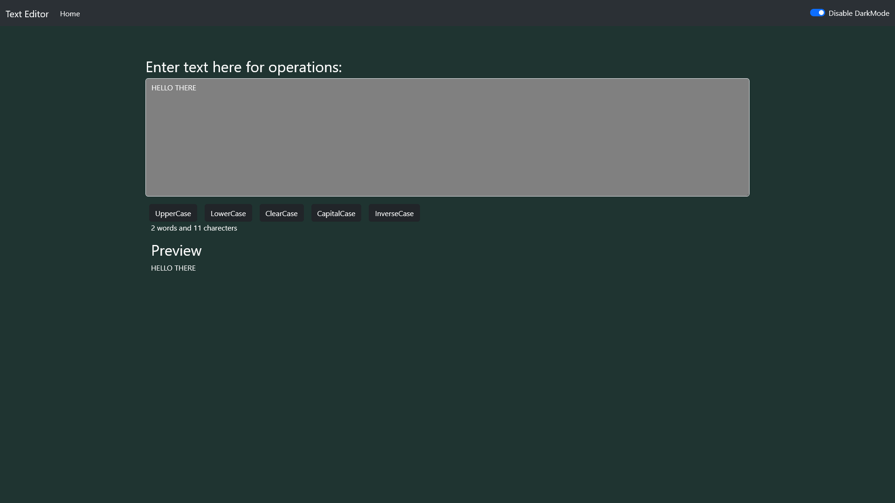

#  Text Editor

A simple and efficient text editor built with React.js, offering essential text formatting features for a seamless writing experience.

##  Features

- **Rich Text Formatting:** Apply bold, italic, and underline styles to your text.
- **User-Friendly Interface:** Intuitive design for easy navigation and editing.
- **Real-Time Preview:** Instantly see the formatted text as you type.

##  Live Demo

Experience the Text Editor in action: [Live Demo](#)

*(Replace `#` with the URL where the project is hosted, if available.)*

##  Screenshots



*Screenshot of the Text Editor interface.*

*(Ensure you have a `screenshots` folder in your project directory containing the `editor_interface.png` image.)*

##  Technologies Used

- **Frontend:** React.js
- **Styling:** CSS

##  Installation and Setup

To run this project locally:

1. **Clone the repository:**
   ```bash
   git clone https://github.com/arijitkayal-gm/Text-Editor.git

